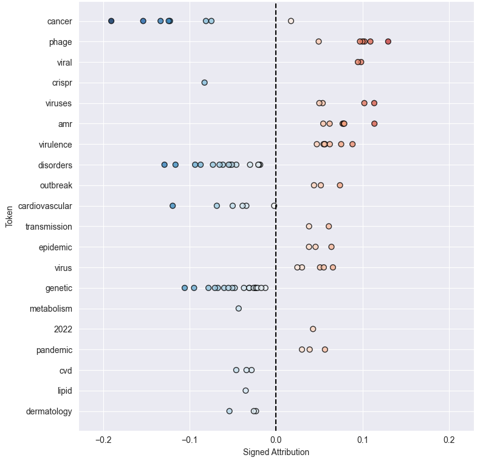
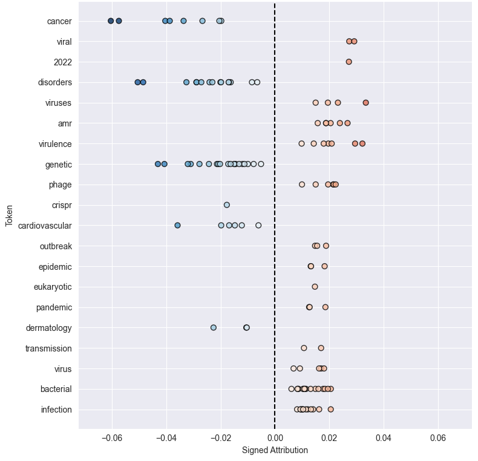
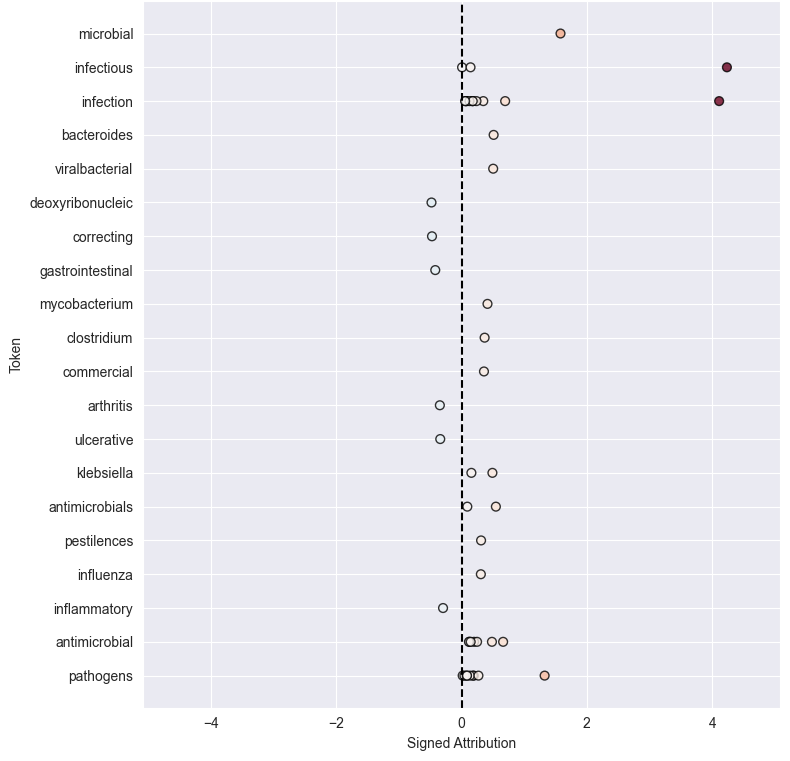
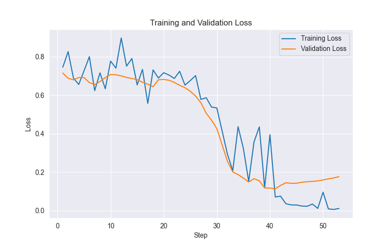

# Explaining Natural Language Processing Predictions in Biosecurity Text Classification
## A first look into explainability / interpretability methods applied to ML binary classification of medical abstracts using both simple and complex NLP training techniques

## Introduction
 Over the past year I've developed a greater interest in high priority risk areas, especially biosecurity and AI safety. With little practical experience in either, I decided to take on a self-directed technical project combining data science, biosecurity and model explainability / interpretability, giving an opportunity to actively learn and build on the data science focussed upskilling I'd undertaken through 2025.
	
The project trains binary text classification models on medical research abstracts to predict whether or not they relate to pathogens, and then applies explainability methods to understand what the models are actually learning and which aspects of the text have the greatest influence on the predictions.

## Approach
### Data Collection
I manually collated and labelled the dataset used in this project. Although time-consuming, this gave me direct control over the labelling process and reduced the risk of obvious annotation errors that can arise from weak heuristics or automated labelling.
	
Abstracts were sourced from PubMed due to its broad coverage of biomedical literature. To obtain a mix of relevant and irrelevant texts, I used targeted search terms. Pathogen-related abstracts were retrieved using terms such as virus, bacteria, infection, and antimicrobial resistance. Non-pathogen abstracts were retrieved using terms unrelated to infectious disease, including cardiovascular disease, cancer, and genetic disorders. In total I collected 300 abstracts, 150 labelled as pathogen-related (class 1) and 150 labelled as not pathogen-related (class 0). The labelled dataset was loaded into Python and split into training and test sets using a standard 80/20 randomised split, maintaining class balance in both sets.

As I am not a medical professional, some degree of label noise is possible. I used a large language model as a secondary consistency check in ambiguous cases. This does not eliminate the risk of mislabelling, but it helped reduce obvious inconsistencies in edge cases.

### Models
As a baseline, I trained a simple Bag-of-Words (BoW) model with logistic regression. This approach requires minimal computational resources, is fast to train, and produces models that are relatively easy to interpret. It served both as a performance baseline and as a reference point for applying established explainability techniques. Model performance was evaluated using standard classification metrics, including accuracy and F1 score.
	
In contrast, I also fine-tuned a BioBERT model using the same training data. BioBERT is a transformer deep neural network model pretrained on large biomedical corpora and is therefore well suited to medical abstracts. This provided an opportunity to work with a substantially more complex model and to explore the practical challenges of fine-tuning deep learning models.
	
The aim was not to achieve state-of-the-art performance, but to compare inherent interpretability in simple models with post-hoc explainability applied to more complex models when applied to the same modestly scoped task and dataset.

### Explainability Methods
Because the two models used in this project differ substantially in complexity and structure, different explainability approaches were required.

The BoW logistic regression model is relatively simple and operates over explicit word features. Each prediction is ultimately driven by weighted word counts, making it well suited to established, model-agnostic explainability techniques. I applied SHAP and LIME to this model to generate local explanations for individual predictions and compare how these two popular methods perform on the same data. In both cases, the explanations take the form of word-level contributions that indicate which terms pushed a prediction toward the pathogen or non-pathogen class, and by how much.
In this context, explainability comes from the fact that:
- Features correspond directly to words in the input text
- Contributions can be understood as additive influences on the final decision

As a result, explanations from SHAP and LIME are relatively intuitive; they highlight specific words or phrases that the model treats as evidence for or against a given class.

BioBERT is a transformer model with contextual token representations and millions of parameters. Its internal representations are not directly human-interpretable, so post-hoc explainability methods are required.
I used Captum, a PyTorch-based library for model interpretability, to compute token-level attribution scores for BioBERT predictions. These attributions indicate how much each token in the input contributed to the model’s predicted class.

Unlike the BoW model, interpretability for BioBERT does not come from directly inspecting model parameters or removing individual input features. Instead, attribution scores are computed using gradient-based methods that measure how sensitive the model’s prediction is to each input token.
These explanations reflect which tokens the model relied on most strongly in the local neighbourhood of a given prediction, rather than the effect of explicitly adding or removing words. As a result, the attributions should be interpreted as relative importance signals, not as direct causal explanations.

Across both models, the explainability methods produce token- or word-level importance scores. However, the meaning of these scores differs:
- For the BoW model, explanations reflect the influence of individual words as explicit features.
- For BioBERT, explanations reflect how contextual token representations contribute to a prediction within a deep neural network.

The purpose of applying these methods was not to declare one approach “better”, but to examine how explanation quality, stability, and intuitiveness change as model complexity increases.

### Comparison and Analysis
Model performance was compared to assess whether the increased complexity of BioBERT translated into meaningful gains over the simpler Bag-of-Words baseline, both in aggregate metrics and in the types of errors each model made.

In parallel, explainability outputs were examined to understand how intuitive and stable the resulting explanations were, and whether they aligned with human expectations about which terms or concepts should be influential. To enable fair comparison across methods, I standardised all explainability outputs to a common word-level attribution format. For the BoW model, SHAP and LIME already produce word-level scores. For BioBERT, Captum generates subword token attributions (due to BERT's WordPiece tokenization), which I aggregated to whole-word scores by summing attributions across subword pieces.

With all methods producing comparable word-level attributions, I identified the top 20 most influential tokens for each method by aggregating attribution scores across the test set. This allowed both global comparison of what features each method deemed important, and analysis of agreement between methods through overlap metrics. The approach enabled a qualitative comparison of how explanation quality changes as model complexity increases, independently of raw predictive performance.

## Key Findings
### Model Performance and Complexity Analysis
Both models achieved strong performance on the test set, with accuracy above 95%. The confusion matrices and classification reports in Tables 1 to 4 below show detailed breakdowns by class.
#### BoW
*Table 1 - BoW Confusion Matrix*

|                    | Predicted class 1  | Predicted class 0  |
|--------------------|--------------------|--------------------|
| **Actual class 1** | True positives: 29 | False Negatives: 1 |
| **Actual class 0** | False Positives: 1 | True Negatives: 29 |

*Table 2 - BoW Classification Report*

|     Class    | Precision | Recall | F1-score |     Support    |
|--------------|-----------|--------|----------|----------------|
| Class 1      | 0.967     | 0.967  | 0.967    |     30         |
| Class 0      | 0.967     | 0.967  | 0.967    |     30         |

#### BioBERT
*Table 3 - BioBERT Confusion Matrix*

|                    | Predicted class 1  | Predicted class 0  |
|--------------------|--------------------|--------------------|
| **Actual class 1** | True positives: 30 | False Negatives: 0 |
| **Actual class 0** | False Positives: 2 | True Negatives: 28 |

*Table 4 - BioBERT Classification Report*

|     Class    | Precision | Recall | F1-score |     Support    |
|--------------|-----------|--------|----------|----------------|
| Class 1      | 0.938     | 1      | 0.968    |     30         |
| Class 0      | 1         | 0.933  | 0.966    |     30         |

#### Misclassified Data
The misclassified data for each model is shown below in Tables 5 and 6. Both models incorrectly predicted 31885873 to be class 1, indicating it is an edge case with features that make classification difficult. The mention of bacteria and fungi may have been interpreted as pathogen-related, even though they are not the focus in this context.

BioBERT also misclassified 31367975, likely because the title mentions "Infectious Diseases," even though the abstract's primary focus was on CRISPR technology rather than pathogens. BoW misclassified 37734419 as class 0, possibly because the focus on inflammatory bowel disease overshadowed the pathogen-related term "pathobionts," which may have been underweighted or poorly understood by the model.

*Table 5 - BoW Misclassifications*

|     Text ID     |     Title                                                                                                                      |     True class    |     Predicted class    |
|-----------------|--------------------------------------------------------------------------------------------------------------------------------|-------------------|------------------------|
|     37734419    |     Pathobionts in   Inflammatory Bowel Disease: Origins, Underlying Mechanisms, and Implications   for Clinical Care          |     1             |     0                  |
|     31885873    |     Comparison of   Japanese and Indian intestinal microbiota shows diet-dependent interaction   between bacteria and fungi    |     0             |     1                  |

*Table 6 - BioBERT Misclassifications*

|     Text ID     |     Title                                                                                                                      |     True class    |     Predicted class    |
|-----------------|--------------------------------------------------------------------------------------------------------------------------------|-------------------|------------------------|
|     31367975    |     CRISPR-Cas9   Probing of Infectious Diseases and Genetic Disorders                                                         |     0             |     1                  |
|     31885873    |     Comparison of   Japanese and Indian intestinal microbiota shows diet-dependent interaction   between bacteria and fungi    |     0             |     1                  |

#### Performance vs Computational Cost Tradeoff
The comparable performance of a linear BoW model and BioBERT suggests that the classification task is largely driven by surface-level lexical features, and may be close to linearly separable in the chosen feature space. Given the significantly higher computational cost (BioBERT took hundreds of times longer to train) and that BioBERT is an inherently less interpretable model, it appears that in this case the BoW model is a much more pragmatic choice of model to use.

### Explainability
The top 20 tokens by absolute attribution score per method are shown below in Figures 1 to 3. There is a noticeable difference in the top tokens identified by SHAP and LIME compared to those identified by Captum. For SHAP and LIME, the top tokens seem intuitive, including terms that clearly denote whether they are pathogen or non-pathogen related. It is easy to see why these terms could influence the model one way or the other. The main exception to this is "2022" which appears in both the SHAP and LIME plots. This likely appears because some abstracts reference pathogen-related studies or events from 2022. The Captum results, however, seem much less intuitive.



*Figure 1 - Top 20 tokens by absolute attribution score aggregated over full test dataset for SHAP*
<br>
<br>



*Figure 2 - Top 20 tokens by absolute attribution score aggregated over full test dataset for LIME*
<br>
<br>



*Figure 3 - Top 20 tokens by absolute attribution score aggregated over full test dataset for Captum*

The difference in results is due to the underlying mechanisms of the explainability methods. SHAP and LIME rely on perturbation techniques, determining the effect of the removal of individual tokens on predictions. Conversely, gradient-based methods such as Captum are not designed for global aggregation, and if a model is already sure of its output then the gradient-based attribution can be flattened or noisy meaning some of the obvious terms do not receive such high attribution scores. Fundamentally, due to the embedding of tokens in a transformer type model being contextual, individual tokens no longer hold as much importance. Self-attention gives meaning to phrases and sentences which will collectively contribute to a model's prediction behaviour. So while the top tokens from Captum mostly do not seem hugely out of place, prominent and intuitive tokens such as "cancer" and "genetic" do not feature at all in the top 20 token scores.

To further investigate this, I identified the top 10 tokens by attribution score for each method across all 60 test texts and calculated the percentage overlap between method pairs as shown below in Table 7:

*Table 7 - Overlap in top 10 tokens per text between pairs of explainability methods, averaged across 60 test texts*

| Method Pair | Average Overlap (%) |
|-------------|---------------------|
| SHAP-LIME   | 77                  |
| SHAP-Captum | 35                  |
| LIME-Captum | 33                  |

The high agreement between SHAP and LIME confirms that both methods identify similar feature importance patterns on the BoW model. The much lower agreement between Captum and SHAP/LIME reflects the fundamental difference between perturbation-based explanations on explicit features versus gradient-based attributions on contextual embeddings.

Local (per-abstract) explanations for SHAP and LIME were also generated and can be explored in the accompanying notebook. These individual examples exhibited the same patterns observed in the global analysis, i.e. both methods produced consistent, interpretable word-level attributions that largely agreed on important features.

## Challenges, Decisions and Reflections
### Learning in Unfamiliar Territory

The biggest challenge I faced during this project was working with largely unfamiliar techniques. While I had previously studied Python and basic supervised learning (decision trees, random forests), this project pushed well beyond that foundation. The initial data preparation and BoW model training felt familiar, but everything outside of that was new territory.

I had never used explainability methods like SHAP or LIME, and I had no prior hands-on experience with neural networks. Working with transformers, fine-tuning BioBERT, and implementing gradient-based attribution methods required learning these concepts from scratch while simultaneously applying them.

This made the project challenging but also incredibly valuable. Rather than simply passively reading about these techniques, I actively implemented and debugged them, which built genuine understanding of how they work and when they're appropriate to use.

### Technical Challenges
#### The Use of AI Chatbots for Coding

Given my limited free time and that the primary goal for this project specifically was understanding explainability techniques rather than developing Python proficiency, I predominantly relied on ChatGPT to generate the code. Nonetheless, I remained engaged in the coding process and made significant modifications throughout. ChatGPT is good at generating code, but it's far from perfect, especially as complexity increases. I learned that if you have to ask for something five times and it's still not working, the issue likely lies elsewhere and ChatGPT doesn't fully understand the problem.
	
I also found that ChatGPT's responses degraded as conversations grew longer. Starting fresh chats with the existing code often produced better results. Interestingly, at the start of one new chat, it suggested several improvements to code it had originally written. Whether this was due to the conversation reset or a model update, it reinforced the important lesson that one should never treat AI-generated code as foolproof. You need to understand what the code is doing and be prepared to debug or rewrite sections yourself.

#### BioBERT Training Pipeline Refinement

One of the parts of the project that I found most interesting and where I actively improved the usability of the code was the BioBERT training pipeline. Once I got the initial training code to run, I found the monitoring outputs insufficient. Training loss wasn't being recorded, and validation loss was only reported at the end of each epoch. With just 3 epochs, I only had three validation loss values: 0.124, 0.147, and 0.220. The first value was already quite low, and the immediate rise suggested potential overfitting, but with so few data points it was difficult to diagnose what was happening.
	
The original ChatGPT code was minimal:
	
```python
# Define training args
training_args = TrainingArguments(
    output_dir='./results',
    num_train_epochs=3,
    per_device_train_batch_size=8,
    per_device_eval_batch_size=8,
    eval_strategy="epoch",
    save_strategy="epoch",
    logging_dir='./logs',
)
```

I expanded this significantly to enable better monitoring and control:
	
```python
# Define training args
output_dir = str(run_dir / "checkpoints")
num_train_epochs=3
per_device_train_batch_size=8
per_device_eval_batch_size=8
eval_strategy="steps"
eval_steps=1
save_strategy="steps"
save_steps=30
logging_dir = str(run_dir / "logs")
disable_tqdm=False
logging_steps=1
report_to="tensorboard"
learning_rate=5e-5
load_best_model_at_end=True
metric_for_best_model="eval_loss"
greater_is_better=False
early_stopping_patience=12

# Assign training args
training_args = TrainingArguments(
    output_dir=output_dir,
    num_train_epochs=num_train_epochs,
    per_device_train_batch_size=per_device_train_batch_size,
    per_device_eval_batch_size=per_device_eval_batch_size,
    eval_strategy=eval_strategy,
    eval_steps=eval_steps,
    save_strategy=save_strategy,
    logging_dir=logging_dir,
    disable_tqdm=disable_tqdm,
    logging_steps=logging_steps,
    report_to=report_to,
    learning_rate=learning_rate,
    load_best_model_at_end=load_best_model_at_end,
    metric_for_best_model=metric_for_best_model,
    greater_is_better=greater_is_better
)
```

Key improvements include:
- Explicit hyperparameter definitions and systematic logging of training metadata including loss curves and evaluation metrics at each step that can be easily exported for reproducibility
- More configurable options for experimentation across multiple training runs
- Step-level evaluation instead of epoch-level, providing much finer granularity for monitoring training and validation loss
- Early stopping to automatically halt training if overfitting occurs

While evaluating at every step is computationally intensive and slows training, for a project focused on understanding model behaviour rather than production deployment, the diagnostic value was worth the overhead.
	
Correctly implementing early stopping required some experimentation. Initially I set patience to 1, which stopped training too aggressively as any single noisy validation step would halt training prematurely. I incrementally increased the patience value (2, 5, 7), but these still stopped training during early fluctuations before the model had properly converged. A patience of 12 finally allowed the model to navigate through early noise while still catching the point where validation loss began to diverge from training loss, indicating genuine overfitting. This is shown below in Figure 4.



*Figure 4 - Training and validation loss over 53 training steps. Early stopping triggered at step 41 when validation loss began to diverge.*

#### Aligning Different Explainability Outputs

Initially, I intended to perform direct positional comparison of token-level attributions across methods, matching attribution scores token-by-token based on their position in the text. However, I quickly discovered that differences in tokenization between the BoW model and BioBERT made this impractical.

The BoW model's simple whitespace tokenization handled punctuation differently than BioBERT's WordPiece tokenizer. For example:
- "95,000" became "95000" in BoW but split into "95" and "000" in BioBERT
- "and/or" became "andor" in BoW but split into "and" and "or" in BioBERT
	
These inconsistencies amongst others meant token counts rarely aligned between models, making positional mapping impractical. While I attempted some postprocessing fixes, the effort required outweighed the value, especially since the attribution patterns were already so different between methods that direct positional comparison would have yielded limited insight. Instead, I focused on aggregate analysis (top tokens across the full test set) and overlap metrics as previously discussed, which proved more informative for understanding method differences.

### Limitations
#### BioBERT Validation on Test Set

During BioBERT training, I inadvertently used the test set as the validation set for monitoring training progress and early stopping. This occurred because I was using ChatGPT-generated code and didn't realize that deep learning requires a separate validation set in addition to the standard train/test split. As a result, the test set was not truly held out, which may have led to slight overfitting to the test distribution and potentially optimistic performance estimates. Standard practice would involve splitting the training data further into training and validation subsets, keeping the test set completely separate until final evaluation.

#### Representative Distribution of Sampling

The dataset was relatively small (300 abstracts) and I did not closely monitor the distribution of subject areas within each class. As a result, the models may have learned to rely on terms that correlate with overrepresented topics in the training set. For example, if cardiovascular papers were overrepresented in the negative class, terms like "cardiac" might receive disproportionate negative attribution, displacing attribution from other valid non-pathogen related terms.

#### Computational Constraints

I ran all code on my own PC, which, while more powerful than a laptop, is not intended for large-scale ML training. BioBERT training and Captum attribution calculations were consequently time-intensive. ChatGPT suggested using my GPU instead of CPU, but my GPU lacked sufficient VRAM. I didn't investigate workarounds extensively since the project followed a relatively linear investigation path with minimal need for repeated training runs. While this may limit my ability to experiment with different architectures or larger datasets in future work, the available resources were sufficient for the project's learning objectives.

## Opportunities for Improvement
### Improved Method Comparability

The current analysis compared methods using token-level attributions and overlap metrics. While this worked well for SHAP and LIME on the BoW model, it was less effective for BioBERT due to the contextual nature of transformer embeddings. Future work could address this in two ways:
1. Higher-level semantic units - Instead of token-level attributions, extract phrase- or sentence-level importance scores from BioBERT. This could be achieved through techniques like hierarchical attention visualization or using SHAP with larger input units, better capturing how transformers process contextual meaning.
2. Method-agnostic evaluation metrics - Rather than comparing attribution scores directly, evaluate both methods using standardised benchmarks such as:
   - Stability - How much explanations vary under small input perturbations
   - Faithfulness - How much prediction confidence drops when top-k important tokens are removed, or how much is retained when only top-k tokens are kept
   - Sparsity - How many tokens account for a given percentage of total importance

These approaches would enable more meaningful comparison across model types and explanation methods.

### Scope Expansion

A natural improvement to the robustness of the model training would stem from scaling up the dataset to tens of thousands of abstracts. While manual labelling at this scale would be impractical, weak supervision techniques could provide initial labels through heuristics, keyword filters, or targeted search terms applied to abstract text or metadata. A smaller gold standard dataset (similar in size to the current project) could then be manually labelled by domain experts. Models would be pre-trained on the weakly labelled data, then validated and fine-tuned on the gold standard, ensuring final predictions reflect meaningful domain-specific patterns rather than simple keyword matching.
	
Beyond improved training data, domain expert validation would strengthen both model development and explanation quality. Medical experts could verify that predictions and their explanations are medically sound, while ML experts could assess model stability under perturbation and evaluate whether explanation methods are being applied appropriately given the model architecture and task constraints.

### Real World Implementation

The original intent of this project was exploratory, focusing on personal development and an initial investigation into explainability and interpretability methods for different model types. However, several aspects of the results suggest a plausible real-world extension of this workflow.
	
A high-value use case would be the automated triage of papers published on preprint servers such as arXiv or bioRxiv to identify abstracts potentially relevant to biosecurity. In this scenario, the system would act as a first-pass filter rather than a decision-making tool, supporting human review by prioritising content for further inspection.
	
Multi-class classification would ideally be introduced to cover a broader range of biosecurity-related categories, accepting that this would require substantially larger and more carefully curated labelled datasets. As such this application would be a longer-term extension rather than an incremental next step.
	
The results of this investigation suggest that a BoW approach may be the most pragmatic modelling choice for this application. Compared to transformer-based models, BoW models offer faster training and inference, greater stability, and more transparent behaviour, making them well-suited for high-throughput screening of large numbers of abstracts.

Explainability tools could be integrated in a user-facing manner, allowing analysts to interrogate individual predictions and inspect the tokens most influential in a given classification. This would support trust and explainability without implying that the explanations constitute causal or ground-truth reasoning.
	
A full-stack implementation would require several components: API integration with preprint servers for automated ingestion, preprocessing pipelines for new submissions, and an interactive dashboard. The dashboard could summarize trends (volume of flagged papers over time, distribution across subject areas) while allowing analysts to inspect individual predictions and their token-level explanations.

## Conclusions

This project compared explainability methods across models of different complexity, revealing several important lessons about explainability in NLP.
	
**Model complexity doesn't guarantee better performance**. The simple BoW model achieved comparable accuracy to BioBERT while requiring far less computational resources and producing more intuitive explanations. This suggests that for modestly-scoped classification tasks with clear lexical signals, sophisticated models may be unnecessary.
	
**Explainability methods are not universally applicable**. SHAP and LIME produced consistent, interpretable token attributions on the BoW model (77% agreement), but Captum's token-level attributions for BioBERT were less intuitive, not because the method failed, but because transformers encode meaning contextually across phrases rather than at the token level. This highlights that explanation quality depends on alignment between the method and the model's internal representations.
	
**Understanding beats automation**. While AI tools like ChatGPT accelerated development, they also introduced errors and conceptual gaps (such as the validation set issue). Critical engagement with the code and underlying concepts was essential for catching mistakes and making informed design decisions.
	
This project successfully achieved its learning objectives: building practical experience with explainability methods, comparing their behaviour across model types, and understanding the tradeoffs between model complexity and interpretability. While significant extensions would be needed for real-world deployment, the methodology demonstrates a viable approach to interpretable text classification in high-stakes domains.